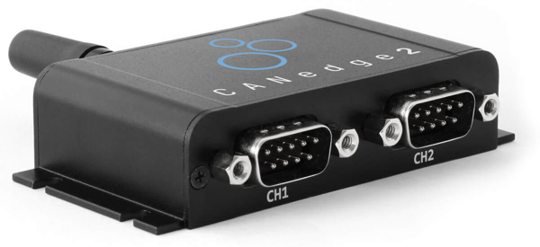
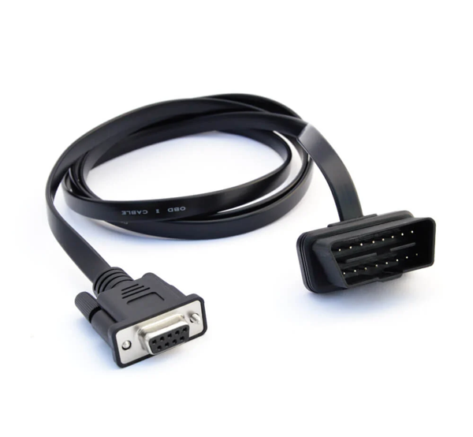
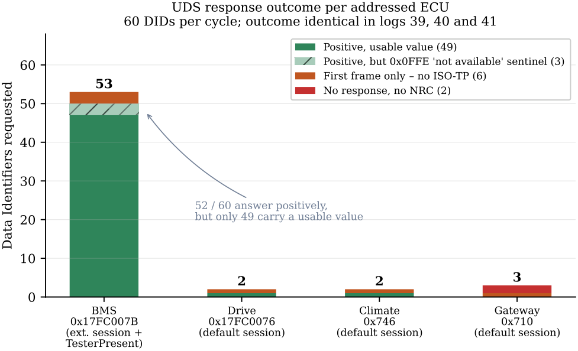
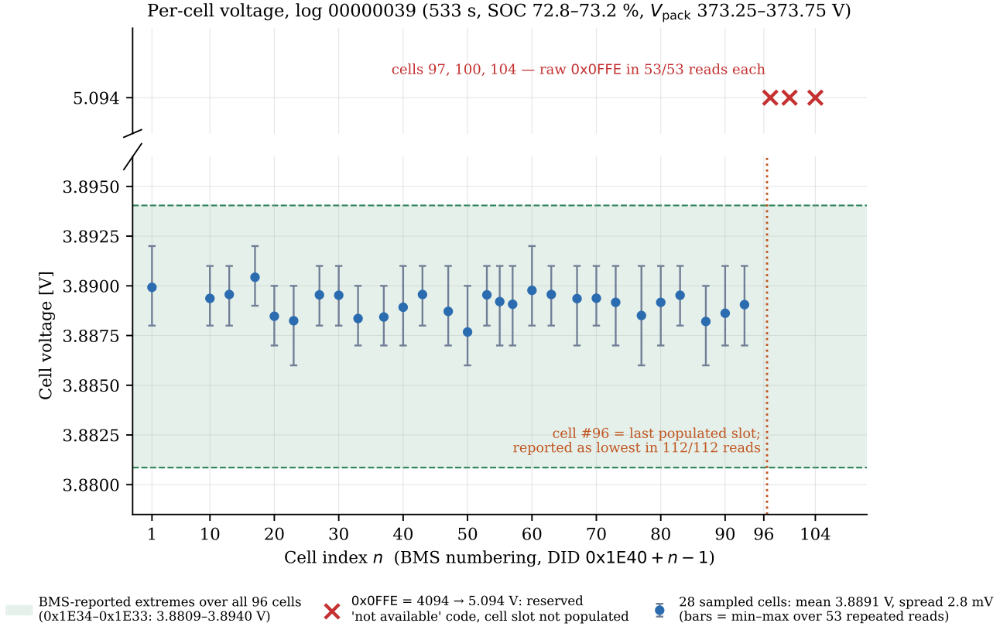
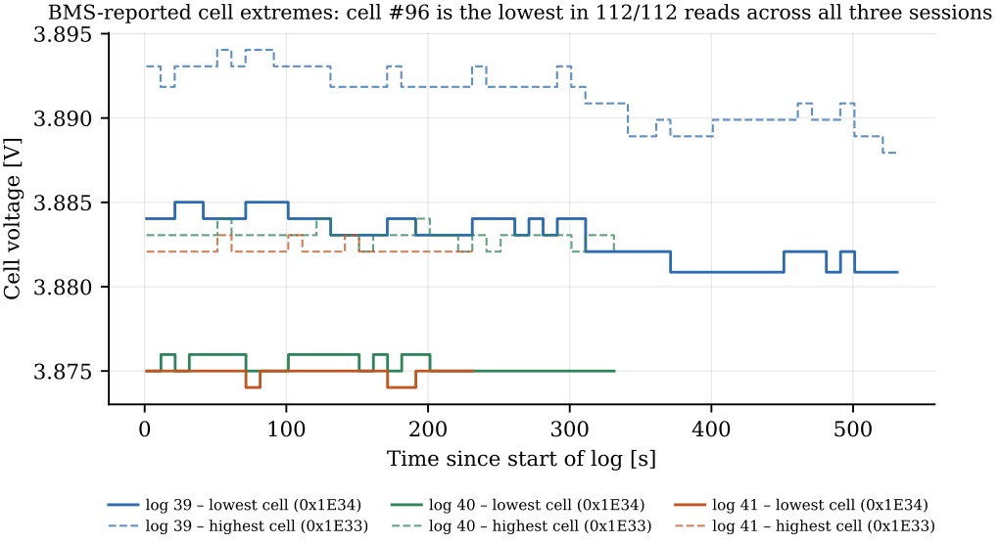
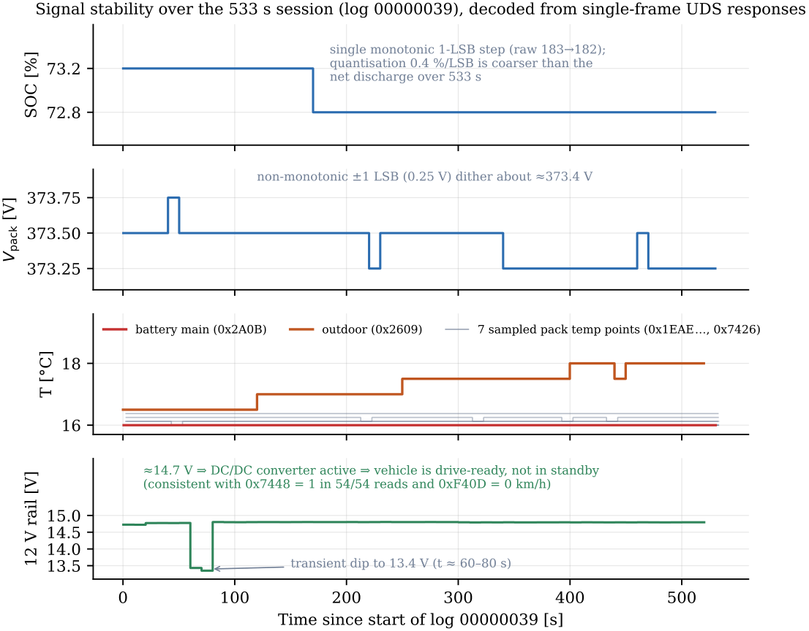
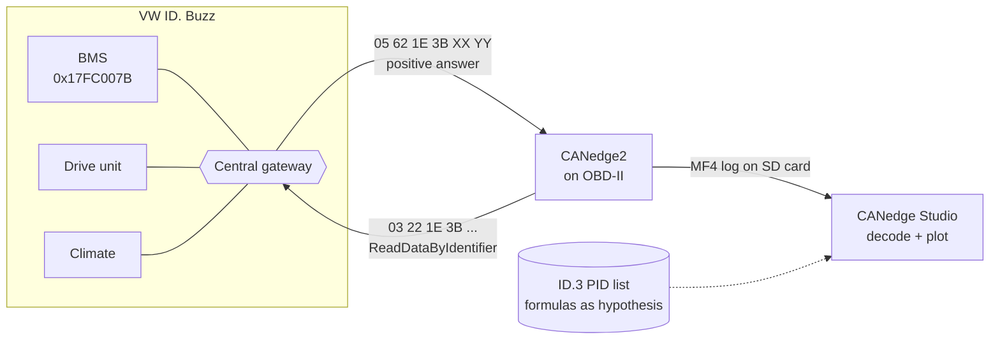
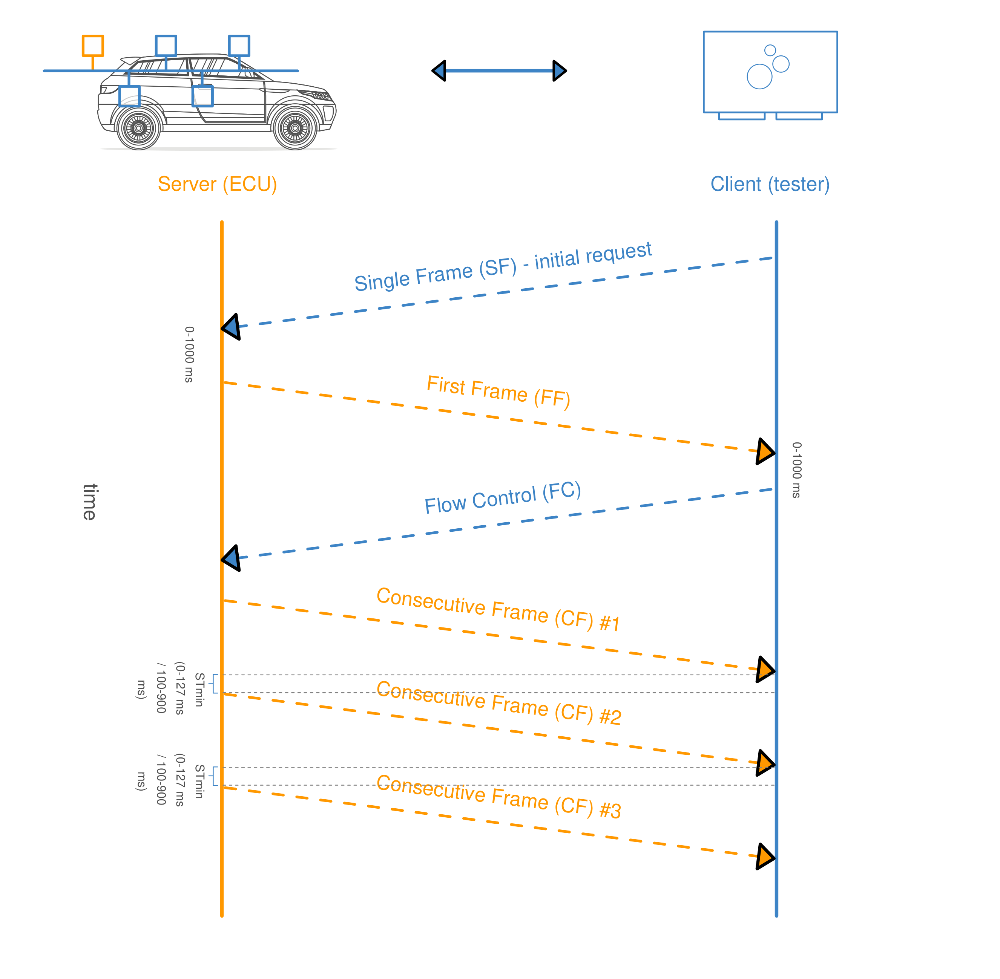
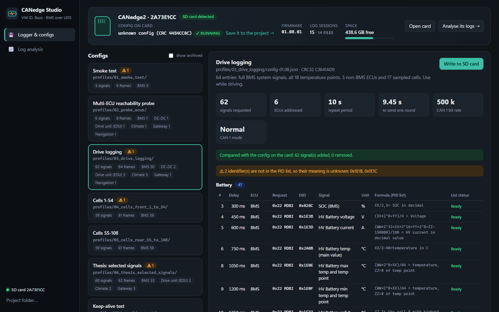
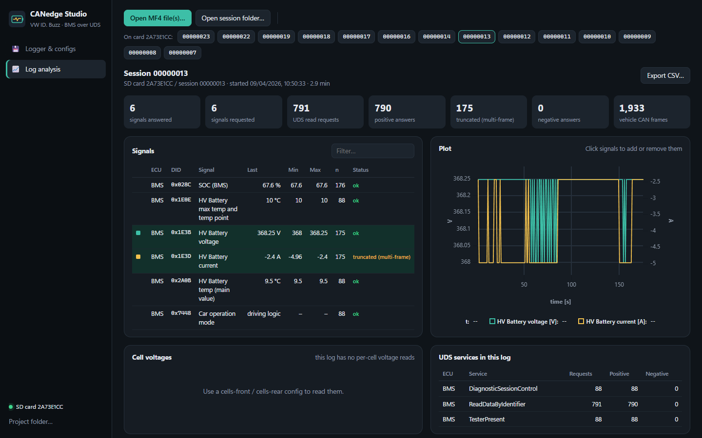

<p align="center">
  <picture>
    <source media="(prefers-color-scheme: dark)" srcset="assets/mark-dark.svg">
    
  </picture>
</p>

<h1 align="center">Reading the battery of a VW ID. Buzz through the OBD-II port</h1>

<p align="center">
  <b>Identification and Interpretation of BMS Signals Through CAN Bus Reverse Engineering on the VW ID. Buzz</b><br>
  Bachelor thesis · Electrical Engineering and Electromobility (B.Eng.) · Technische Hochschule Ingolstadt · 2026<br>
  Muhamad Alif Izzuwan Bin Ibrahim
</p>

<p align="center">
  <a href="50_Thesis/latex/thesis.pdf"></a>
  
  
  
  
</p>

<table>
<tr>
<td width="44%"></td>
<td width="28%"><br><sub>CANedge2 logger: records CAN to an SD card and can transmit a request list</sub></td>
<td width="28%"><br><sub>OBD-II to DB9 cable into the car's diagnostic port</sub></td>
</tr>
</table>

---

## The problem

The high-voltage battery is the most important and the most expensive part of an electric car, yet what its
battery-management system (BMS) knows (state of charge, cell voltages, temperatures) is locked inside
proprietary messages. Research on battery ageing, fleet monitoring or second-life use needs exactly that data.

On Volkswagen's MEB platform there is an extra obstacle: **a central gateway separates the powertrain CAN
buses from the diagnostic connector.** Plugging a logger into the OBD-II port and listening, the classic
reverse-engineering approach, shows none of the BMS traffic.

**The approach of this thesis: ask instead of listen.** A CANedge2 logger on the OBD-II port sends UDS
*ReadDataByIdentifier* requests through the gateway to the BMS and other ECUs, and records the requests and the
answers on one hardware time base, with no laptop or second tester on the bus. A public identifier list for
the related VW ID.3 supplies candidate identifiers and formulas, and is treated as an **unverified
hypothesis** to be tested against the ID. Buzz.

## Results

| | |
|---|---|
| Identifiers requested per cycle | **60**, across 4 ECUs (BMS, drive unit, climate, gateway) |
| Positive single-frame answers | **52**, of which 49 carried a usable value |
| Truncated to the first frame | 6 (the logger's transmit engine has no ISO-TP flow control) |
| Never answered | 2 |
| Pack voltage | 373.25-373.75 V |
| Cell voltages (28 sampled) | 3.888-3.890 V, inter-cell spread 2.8 mV |
| Pack temperatures | 16.0-16.4 °C, reproducible over 3 independent sessions |

**Three findings the ID.3 list does not contain:**

1. Raw code **`0x0FFE`** is a reserved *not-available* marker returned by unpopulated cell slots. Read as a
   voltage it would be an impossible 5.094 V.
2. The leading bytes of the cell-extreme identifiers `0x1E33` / `0x1E34` carry the **cell voltage x 1/4096 V**.
   The list only documents the trailing cell-number byte.
3. The pack exposes exactly **96 cell-voltage channels**, shown by three independent lines of evidence.

<table>
<tr>
<td width="50%"><br><sub>What came back for each of the 60 identifiers, by control unit</sub></td>
<td width="50%"><br><sub>Per-cell voltage and the end of the populated address space (slot 97+ = 0x0FFE)</sub></td>
</tr>
<tr>
<td><br><sub>Highest / lowest cell from 0x1E33 / 0x1E34, decoded with the 1/4096 scaling</sub></td>
<td><br><sub>The decoded values are reproducible across independent sessions</sub></td>
</tr>
</table>

**Limits, stated plainly:** all recordings were taken drive-ready but stationary, so current- and power-related
identifiers never left idle, and only two signals could be checked against a reference independent of the bus.
The pack current answer is multi-frame and arrives truncated, and state of health was not requested.

## How it works



Every request is a single CAN frame (`03 22 <DID hi> <DID lo> 55 55 55 55`, VW padding `0x55`), sent to the ECU's
29-bit diagnostic address. The logger repeats its list every 10 s, staggered by 150 ms so the gateway is never
flooded. Its own requests are logged too, so one MF4 file holds both the question and the answer.

<p align="center"><br>
<sub>The acquisition and decoding workflow, including the three failure branches the campaign hit (from the thesis)</sub></p>

## Work process

| When | Step | What happened |
|---|---|---|
| Feb 2026 | **Topic** | THI thesis topic: decode BMS data of a VW ID. Buzz from the CAN bus. |
| Mar 2026 | **Listening** | Logged the OBD-II port and analysed broadcast frames byte by byte (bit heat-maps, counters, 16-bit candidates). Result: the BMS frames never reach the port. The gateway keeps them private, and most traffic in those logs was the logger's own GNSS/IMU bus. |
| 9 Apr 2026 | **Asking** | Switched CAN 1 from *Restricted* (listen-only) to *Normal* and built a UDS request list. First sessions with real BMS answers: SOC, pack voltage, current, temperature, operating mode. |
| May 2026 | **Decoding** | Decoder that applies the ID.3 list's formulas to the answers. Found that the logger's MF4 files split 11-bit and 29-bit frames into separate groups, which earlier tools had silently dropped. |
| May-Aug 2026 | **Sweeps** | Logger profiles: multi-ECU probe, drive logging, and two cell sweeps that together cover all 108 cell slots. Each identifier's answer tested against the car's physical state. |
| Jul-Aug 2026 | **Analysis and writing** | The 60-identifier campaign of Chapter 4, the 0x0FFE and 1/4096 findings, the 96-channel evidence. Reviews and rewrites. |
| 3 Sep 2026 | **Submitted** | 62 pages, six chapters: Introduction, Fundamentals, Materials and Methods, Results, Discussion, Conclusion. |
| Oct 2026 | **Tooling** | Everything consolidated into **CANedge Studio**, one desktop app, and the project cleaned up into this layout. |

## CANedge Studio

A normal Windows program (no Python, no command line) for the two jobs this project needs over and over.

**Logger & configs.** It detects the CANedge SD card the moment it is inserted, shows which profile is on it
and whether the logger has actually run it, and explains any profile in plain terms: every UDS request it
sends, the signal behind each identifier, its unit and formula from the PID list, plus warnings (listen-only
mode, unknown identifiers, overlapping timing). Writing a profile to the card backs up the old files first and
verifies the result by CRC.



**Log analysis.** Open an MF4 file, or click a session straight from the SD card. You get every decoded signal
with min/max/last, interactive plots, a per-cell voltage chart, the UDS services exchanged per ECU, and a CSV
export. The thesis findings (1/4096 cell extremes, 0x0FFE not-available) are applied automatically, and
truncated, negative and unanswered requests are named as such.



It also says when a log holds no vehicle traffic at all, and why:


**Install:** run `30_Software/canedge_studio/build_exe.ps1` once (right-click > Run with PowerShell). It builds the
program (about 80 MB) in a private environment and puts **CANedge Studio** on the Desktop and in the Start menu.

## Logger profiles

Each folder in [`20_Hardware/canedge/profiles/`](20_Hardware/canedge/README.md) is one complete SD-card setup
(`config-01.08.json` + schema files). Copy the folder's files to the card, or let CANedge Studio do it.

| Profile | Use it for | Signals |
|---|---|---|
| `01_smoke_test` | First test on a car: bus up, BMS answers? | 5 |
| `02_probe_ecus` | Which ECUs behind the gateway answer | 6 |
| `03_drive_logging` | Driving: BMS, 18 temperatures, other ECUs, 17 cells | 62 |
| `04_cells_front_1_to_54` | Parked or charging: cells 1-54 | 59 |
| `05_cells_rear_55_to_108` | Parked or charging: cells 55-108 | 59 |
| `06_thesis_selected_signals` | The 60 identifiers evaluated in the thesis | 60 |
| `07_keepalive_test` | Troubleshooting keep-alives | 0 |

## Repository layout

```
00_Organization/        topic description
10_Literature/          working notes: CAN reading guide, UDS working process, project overview, documentation
20_Hardware/canedge/    logger profiles (one SD-card-ready folder each) + device info
30_Software/
  canedge_studio/       the desktop app: SD card + profiles, MF4 log analysis (tests: test_studio.py)
  build_canedge_transmit_config.py   generate new profiles from the PID list
  uds_battery_decoder.py, mf4_reader.py   batch decoding used for the thesis tables and plots
  _archive/             earlier tools, superseded by CANedge Studio
40_Experiments/
  data/                 PID list, MF4 logs, the 2026-04-09 SD-card dump
  plots/                decoded signals and the March broadcast analysis
50_Thesis/
  latex/                final sources: thesis.tex, references.bib, figures/ (+ thesis.pdf)
  opus_abstract.txt     abstract as submitted to the university repository
CHANGELOG.md            what was done when
```

Naming: numbered top-level folders, everything inside in `lower_snake_case`, dated files as `YYYY-MM-DD_name`.
The only exceptions are `README.md` / `CHANGELOG.md` and the names the logger itself requires
(`config-01.08.json`, `device.json`, `LOG/`, `*.MF4`).

## Build the thesis

```bash
cd 50_Thesis/latex
pdflatex thesis && bibtex thesis && pdflatex thesis && pdflatex thesis
```

Needs a TeX distribution with KOMA-Script, EB Garamond and `IEEEtran` (MiKTeX or TeX Live).

<sub>Raw recordings beyond the samples in `40_Experiments/data`, signed university documents and the logger vendor's
tools are not part of this repository.</sub>
